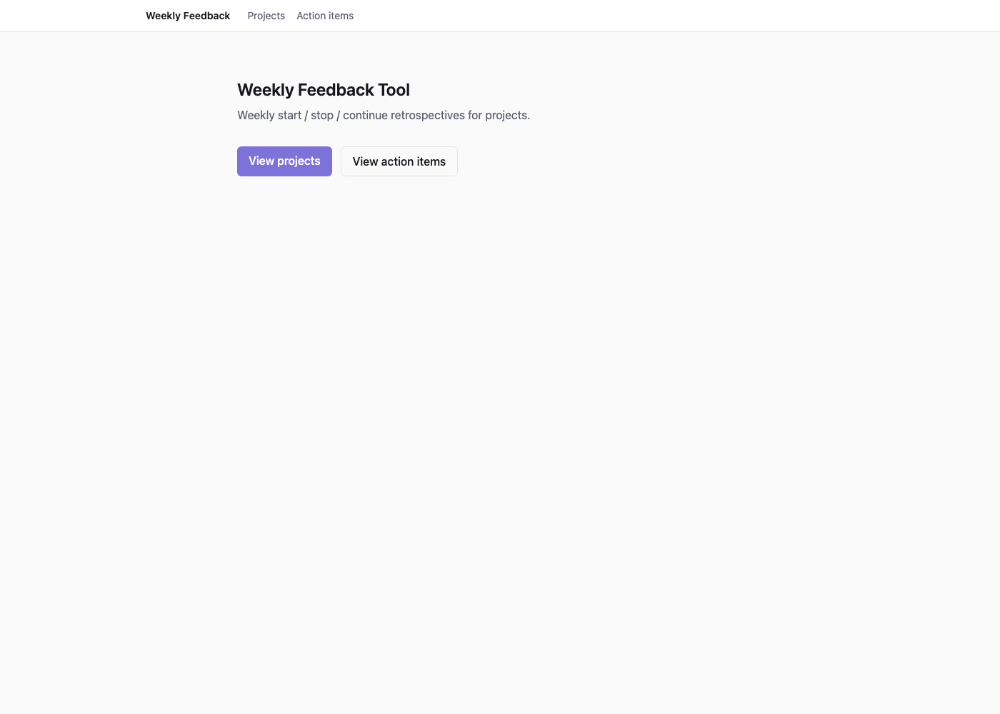
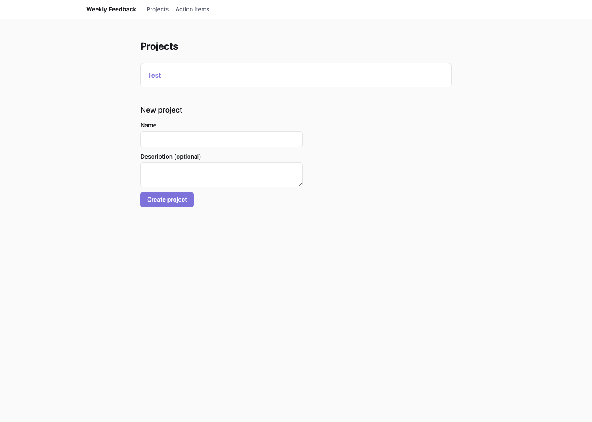
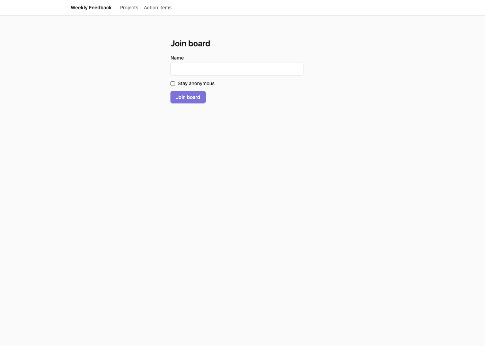
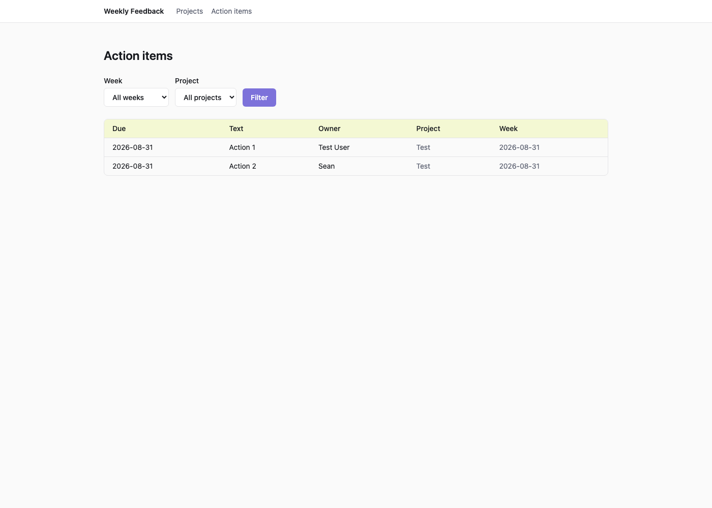

# Weekly Feedback Tool

A web app for running weekly **start / stop / continue** retrospectives on
code, technical, and design projects. Pick a project, pick a week, share the
board link — people submit cards async during the week, then a live session
reveals, clusters, votes, and turns the winners into decisions and action
items.

Next.js (App Router) + Supabase (Postgres + Realtime + RLS). No accounts —
identity is a per-board browser cookie. Pre-reveal card privacy and vote
budgets are enforced in Postgres itself (row-level security), not just
hidden in the UI.

Built following the [`ai-dev-tools-zoomcamp/01-ai-native-workflow`](https://github.com/DataTalksClub/ai-dev-tools-zoomcamp/tree/main/01-ai-native-workflow) guide.

## Setup

```bash
npm install
supabase start          # local Postgres + Realtime + Studio via Docker
supabase db reset       # applies supabase/migrations/ + supabase/seed.sql
cp .env.example .env.local   # supabase start prints the URL/anon key to use
npm run dev
```

App: http://localhost:3000 — Supabase Studio: http://127.0.0.1:54323

## Quick start

```
1. Open /projects, create a project.
2. Open the project, pick a week, "Open / create board".
3. Open the board link in two browser windows (two participants).
4. Each window: join with a name (or stay anonymous), add a few
   Start/Stop/Continue cards. Each window sees only its own cards so far.
5. Either window: "Become facilitator", then "Reveal all cards".
   Now both windows see every card, grouped by category.
6. Drag similar cards together into clusters, rename a cluster.
7. Facilitator: "Start voting". Each participant gets 3 votes, stackable.
8. Facilitator: "Start discussion". Add decision notes and action items
   (text + owner + due date) on the top clusters.
9. Open /action-items — the items you just added, filterable by week/project.
```

## Pages

| Route | What it does |
| --- | --- |
| `/` | Landing page, links to Projects and Action items |
| `/projects` | List projects, create a new one |
| `/projects/[projectId]` | A project's weekly boards, open/create a board for a week |
| `/board/[boardId]` | The retro board itself — join screen, then submit/cluster/vote/discuss depending on phase |
| `/board/[boardId]/realtime-demo` | Throwaway demo proving the realtime plumbing works, not part of the product flow |
| `/action-items` | Action items across every board, filterable by week and project |

## Two things worth knowing

- **Facilitator is self-claimed.** Any participant can click "Become
  facilitator" — no secret link. Only one facilitator per board; claiming
  it replaces whoever had it. Facilitator-only actions (reveal, advance
  phase) are still rejected server-side for anyone else, even if the UI is
  bypassed.
- **Pre-reveal privacy is enforced in Postgres**, not just hidden in the
  client. While a board is in the `submit` phase, a participant's queries
  return only their own cards — proven by RLS policies
  (`supabase/migrations/20260825230500_cards_rls.sql`), not app-layer
  filtering. Same for the 3-vote budget: a 4th vote is rejected by a
  database policy, not a disabled button.

## Where the data lives

- Schema: `supabase/migrations/` (applied in order — see file names for what
  each one does; `_docs/schema.md` has a table-by-table summary).
- Demo data: `supabase/seed.sql` (one project + one board, for local dev).
- Local dev uses the Dockerized stack from `supabase start`. Production
  uses a separate hosted Supabase project — `supabase link` +
  `supabase db push` applies the same migrations there.

## Development

```bash
npm test          # vitest — pure-logic unit tests (validation, phase rules)
npm run build     # next build — also type-checks
```

Deployed to Vercel (`vercel --prod`), hosted Supabase project via
`supabase db push`. `_docs/tasks.md` is the full task backlog with
acceptance criteria for every feature; `_docs/design-guidelines.md` covers
the color tokens and component conventions.

## Screenshots (live deployment)

The hosted deployment won't stay up forever, so here's what it looked like
running, taken 2026-08-26:

| Home | Projects |
| --- | --- |
|  |  |

| Board (join screen) | Action items |
| --- | --- |
|  |  |
